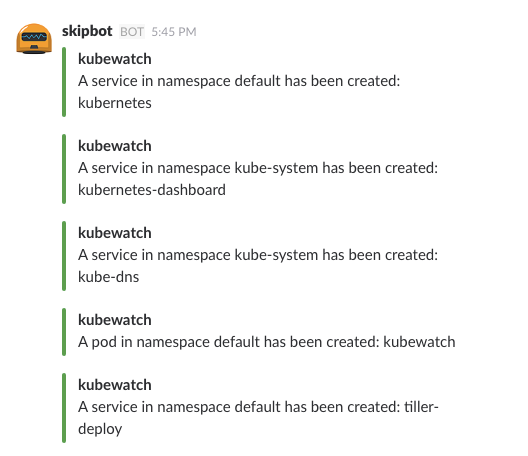

# Kubewatch

[](https://travis-ci.org/bitnami-labs/kubewatch) [](https://skippbox.herokuapp.com)

`kubewatch` is a Kubernetes watcher that currently publishes notification to Slack. Run it in your k8s cluster, and you will get event notifications in a slack channel.

## Create a Slack bot

Create a new Bot: [https://my.slack.com/services/new/bot](https://my.slack.com/services/new/bot)

Edit the Bot to customize its name, icon and retrieve the API token (it starts with `xoxb-`).

Invite the Bot into your channel by typing: `/join @name_of_your_bot` in the Slack message area.

## Installing kubewatch using helm

When you have helm installed in your cluster, use the following setup:

```console
helm install kubewatch stable/kubewatch --set='rbac.create=true,slack.channel=#YOUR_CHANNEL,slack.token=xoxb-YOUR_TOKEN,resourcesToWatch.pod=true,resourcesToWatch.daemonset=true'
```

You may also provide a values file instead:

```yaml
rbac:
  create: true
resourcesToWatch:
  daemonset:
   watch: true
   events:
    create: true
    update: true
    delete: false
  deployment:
   watch: true
   events: 
    create: true
    update: true
    delete: false
  pod:
   watch: true
   events: 
    create: true
    update: true
    delete: true
  replicaset:
   watch: true
   events: 
    create: true
    update: true
    delete: false
  replicationcontroller:
   watch: true
   events: 
    create: true
    update: true
    delete: false
  services:
   watch: true
   events: 
    create: true
    update: true
    delete: false
  secret:
   watch: true
   events: 
    create: true
    update: true
    delete: false
  configmap:
   watch: true
   events: 
    create: true
    update: true
    delete: false
slack:
  channel: '#YOUR_CHANNEL'
  token: 'xoxb-YOUR_TOKEN'
```

And use that:

```console
$ helm upgrade --install kubewatch stable/kubewatch --values=values-file.yml
```

## Installing kubewatch using kubectl

In order to run kubewatch in a Kubernetes cluster quickly, the easiest way is for you to create a [ConfigMap](https://github.com/bitnami-labs/kubewatch/blob/master/kubewatch-configmap.yaml) to hold kubewatch configuration. It contains the SLACK bot API token and channel to use.

An example is provided at [`kubewatch-configmap.yaml`](https://github.com/bitnami-labs/kubewatch/blob/master/kubewatch-configmap.yaml), do not forget to update your own slack channel and token parameters. Alternatively, you could use secrets.

Create k8s configmap:

```console
$ kubectl create -f kubewatch-configmap.yaml
```

Create the [Pod](https://github.com/bitnami-labs/kubewatch/blob/master/kubewatch.yaml) directly, or create your own deployment:

```console
$ kubectl create -f kubewatch.yaml
```

A `kubewatch` container will be created along with `kubectl` sidecar container in order to reach the API server.

Once the Pod is running, you will start seeing Kubernetes events in your configured Slack channel. Here is a screenshot:



To modify what notifications you get, update the `kubewatch` ConfigMap and turn on and off (true/false) resources:

```
resource:
      deployment:
       watch: true
       events: 
        create: true
        update: true
        delete: false
      replicationcontroller:
       watch: true
       events: 
        create: true
        update: true
        delete: false
      replicaset:
       watch: true
       events: 
        create: true
        update: true
        delete: true
      daemonset:
       watch: true
       events: 
        create: true
        update: true
        delete: false
      services:
       watch: true
       events: 
        create: true
        update: true
        delete: false
      pod:
       watch: true
       events: 
        create: true
        update: true
        delete: false
      secret:
       watch: true
       events: 
        create: true
        update: true
        delete: false
      configmap:
       watch: true
       events: 
        create: true
        update: true
        delete: false
      ingress:
       watch: true
       events: 
        create: true
        update: true
        delete: false
```

### Working with RBAC

Kubernetes Engine clusters running versions 1.6 or higher introduced Role-Based Access Control (RBAC). We can create `ServiceAccount` for it to work with RBAC.

```console
$ kubectl create -f kubewatch-service-account.yaml
```

If you do not have permission to create it, you need to become a admin first. For example, in GKE you would run:

```
$ kubectl create clusterrolebinding cluster-admin-binding --clusterrole=cluster-admin --user=REPLACE_EMAIL_HERE
```

Edit `kubewatch.yaml`, and create a new field under `spec` with `serviceAccountName: kubewatch`, you can achieve this by running:

```console
$ sed -i '/spec:/a\ \ serviceAccountName: kubewatch' kubewatch.yaml
```

Then just create `pod` as usual with:

```console
$ kubectl create -f kubewatch.yaml
```

## Building

### Building with go

* you need go v1.5 or later.
* if your working copy is not in your `GOPATH`, you need to set it accordingly.

```console
$ go build -o kubewatch main.go
```

You can also use the Makefile directly:

```console
$ make build
```

### Building with Docker

```console
$ make docker-image
$ docker images
REPOSITORY          TAG                 IMAGE ID            CREATED              SIZE
kubewatch           latest              919896d3cd90        3 minutes ago       27.9MB
```

## Download kubewatch package

```console
$ go get -u github.com/bitnami-labs/kubewatch
```

## Configuration

Kubewatch supports `config` command for configuration. Config file will be saved at $HOME/.kubewatch.yaml

### Configure slack

```console
$ kubewatch config slack --channel <slack_channel> --token <slack_token>
```

### Configure flock

```console
$ kubewatch config flock --url <flock_webhook_url>
```

### Configure resources to be watched

```console
// rc, po and svc will be watched
$ kubewatch config resource --rc --po --svc

// only svc will be watched
$ kubewatch config resource --svc
```

### Environment variables

You have an altenative choice to set your SLACK token, channel via environment variables:

```console
$ export KW_SLACK_TOKEN='XXXXXXXXXXXXXXXX'
$ export KW_SLACK_CHANNEL='#channel_name'
```

You have an altenative choice to set your FLOCK URL

```console
$ export KW_FLOCK_URL='https://api.flock.com/hooks/sendMessage/XXXXXXXX'
```

### Run kubewatch locally

```console
$ kubewatch
```
